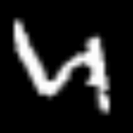

T-SNE: A Dimensionality Reduction Technique Exploration
================
Maciej Kuchciak
January 2024

<script type="text/javascript" async
  src="https://cdnjs.cloudflare.com/ajax/libs/mathjax/2.7.7/MathJax.js?config=TeX-MML-AM_CHTML">
</script>

- [Introduction](#introduction)
  - [Overview of dimensionality reduction in unsupervised
    learning](#overview-of-dimensionality-reduction-in-unsupervised-learning)
  - [Significance of t-SNE](#significance-of-t-sne)
- [Methodology](#methodology)
  - [Selection of dataset](#selection-of-dataset)
  - [Understanding t-SNE](#understanding-t-sne)
  - [Step-by-Step t-SNE Process](#step-by-step-t-sne-process)
    - [**Step 1**: Compute Pairwise Similarities in High-Dimensional
      Space](#step-1-compute-pairwise-similarities-in-high-dimensional-space)
    - [**Step 2**: Symmetrize the Probability
      Distribution](#step-2-symmetrize-the-probability-distribution)
    - [**Step 3**: Compute Pairwise Similarities in Low-Dimensional
      Space](#step-3-compute-pairwise-similarities-in-low-dimensional-space)
    - [**Step 4**: Minimize the Kullback–Leibler
      Divergence](#step-4-minimize-the-kullbackleibler-divergence)
  - [Application of t-SNE](#application-of-t-sne)
    - [Hyperparameter Tuning in t-SNE](#hyperparameter-tuning-in-t-sne)
    - [Summary](#summary)
- [Technical Insights](#technical-insights)
  - [Distance Preservation in t-SNE](#distance-preservation-in-t-sne)
  - [Understanding the Cost Function: Kullback–Leibler
    Divergence](#understanding-the-cost-function-kullbackleibler-divergence)
  - [Scaling and Optimization
    Challenges](#scaling-and-optimization-challenges)
- [Practical Application Tips](#practical-application-tips)
  - [Data Preprocessing for t-SNE](#data-preprocessing-for-t-sne)
  - [Choosing Hyperparameters for
    t-SNE](#choosing-hyperparameters-for-t-sne)
- [Challenges and Limitations of
  t-SNE](#challenges-and-limitations-of-t-sne)
- [Conclusion](#conclusion)

------------------------------------------------------------------------

## Introduction

### Overview of dimensionality reduction in unsupervised learning

Dimensionality reduction is a fundamental step in unsupervised learning
that enables the analysis and visualization of high-dimensional data.
Techniques like t-Distributed Stochastic Neighbor Embedding (t-SNE) help
in representation of complex datasets in a lower-dimensional space,
preserving significant patterns and relationships from the original
data. This process is important for exploring and understanding the
structure of data, identifying clusters, and improving the performance
of machine learning models.

------------------------------------------------------------------------

### Significance of t-SNE

t-SNE, developed by Laurens van der Maaten and Geoffrey Hinton, stands
out from dimensionality reduction techniques through its great
capability to maintain local data relationships and potential to
discover data clusters in an easily understood manner. By converting
high-dimensional Euclidean distances between data points into
conditional probabilities that represent similarities, t-SNE allows for
the visualization of multi-dimensional data in two or three dimensions.
This makes t-SNE particularly valuable for datasets like MNIST, where
understanding the distribution and separation of digit representations
can provide insights into the complexity of the data.

------------------------------------------------------------------------

## Methodology

### Selection of dataset

The MNIST dataset was used as a source of data for this research. It is
a large database of handwritten digits, It is a large database of
handwritten digits. It was chosen for this study due to its complexity
and high dimensionality. With 60,000 training and 10,000 test grayscale
images of 28x28 pixels, MNIST is a challenging dataset for visualization
and pattern recognition, making it ideal for t-SNE.

<figure>

<figcaption aria-hidden="true">MNIST sample of images</figcaption>
</figure>

------------------------------------------------------------------------

### Understanding t-SNE

t-Distributed Stochastic Neighbor Embedding (t-SNE) is a machine
learning algorithm designed for visualizing high-dimensional data in a
low-dimensional space of two or three dimensions. It is a non-linear
dimensionality reduction technique that works well for embedding complex
data for visualization purposes.

------------------------------------------------------------------------

### Step-by-Step t-SNE Process

#### **Step 1**: Compute Pairwise Similarities in High-Dimensional Space

For each pair of points $x_i$ and $x_j$, compute the conditional
probability that $x_i$ would pick $x_j$ as its neighbor.

$$ p_{j|i} = 2 $$ 


probability that
$$ p_{j|i} = 2 $$ 
as its neighbor.

$$
p_{j|i} = \frac{\exp(-\|x_i - x_j\|^2 / 2\sigma_i^2)}{\sum_{k \neq i} \exp(-\|x_i - x_k\|^2 / 2\sigma_i^2)}
$$

- $x_i, x_j$: Data points in the original high-dimensional space.
- $p_{j|i}$: Conditional probability that point $x_i$ would pick $x_j$
  as its neighbor, based on their distance and the density of points
  around $x_i$.
- $\sigma_i$: The standard deviation of the Gaussian distribution
  centered on $x_i$, adjusted for each point to maintain a consistent
  perplexity across the dataset.

#### **Step 2**: Symmetrize the Probability Distribution

Define the joint probability $p_{ij}$ as the symmetrized conditional
probabilities.

$$
p_{ij} = \frac{p_{j|i} + p_{i|j}}{2N}
$$

- $p_{ij}$: The joint probability that points $x_i$ and $x_j$ pick each
  other as neighbors. It’s symmetrized to ensure that the relationship
  is mutual, thereby stabilizing the embedding.
- $N$: Total number of points in the dataset, used for normalization.

#### **Step 3**: Compute Pairwise Similarities in Low-Dimensional Space

Use a similar probability distribution with a Student-t distribution in
the low-dimensional space.

$$
q_{ij} = \frac{(1 + \|y_i - y_j\|^2)^{-1}}{\sum_{k \neq l}(1 + \|y_k - y_l\|^2)^{-1}}
$$

- $y_i, y_j$: Data points in the low-dimensional space, corresponding to
  $x_i$ and $x_j$.
- $q_{ij}$: Probability that points $y_i$ and $y_j$ are neighbors in the
  low-dimensional space, using a Student-t distribution to allow for
  effective separation of clusters by increasing the effective distance
  between moderately distant points.

#### **Step 4**: Minimize the Kullback–Leibler Divergence

Minimize the Kullback–Leibler divergence between the high-dimensional
and low-dimensional probability distributions.

$$
KL(P\|Q) = \sum_{i \neq j} p_{ij} \log \frac{p_{ij}}{q_{ij}}
$$

- $KL(P||Q)$: The Kullback–Leibler divergence, is a measure of how
  probability distribution of one probability distribution differs from
  a second. In the context of t-SNE, it quantifies the difference
  between the high-dimensional pairwise similarities ($P$) and their
  low-dimensional counterparts ($Q$).

- $p_{ij}$: The joint probability in the high-dimensional space,
  indicating the probability that points $x_i$ and $x_j$ are neighbors.
  It reflects the similarity between points as modeled by a Gaussian
  distribution in the original space.

- $q_{ij}$: The joint probability in the low-dimensional space, modeling
  the similarity between points $y_i$ and $y_j$ using a Student-t
  distribution. The use of the Student-t distribution helps to mitigate
  the crowding problem by effectively spreading out points that are
  moderately far apart in the high-dimensional space.

- $\log \frac{p_{ij}}{q_{ij}}$: The logarithm of the ratio of $p_{ij}$
  to $q_{ij}$, contributing to the KL divergence calculation. When
  $p_{ij}$ closely matches $q_{ij}$, their ratio approaches 1, and the
  logarithm approaches 0, indicating little divergence. Large
  discrepancies between $p_{ij}$ and $q_{ij}$ contribute positively to
  the KL divergence, signaling a poor match between the high-dimensional
  and low-dimensional representations.

- $\sum_{i \neq j}$: The sum over all distinct pairs of points, ensuring
  that the entire distribution of pairwise similarities is considered in
  the divergence calculation. This summation accounts for the collective
  arrangement of all points in the embedding space, emphasizing the
  preservation of local structures defined by the pairwise
  probabilities.

The goal of minimizing $KL(P||Q)$ is to adjust the positions of points
in the low-dimensional space ($y_i$) such that $Q$ resembles $P$ as
closely as possible, thereby ensuring that the t-SNE embeddings
faithfully represent the original data’s structure. This optimization
process is typically achieved through gradient descent, iteratively
adjusting the points’ positions to reduce the KL divergence until a
stable, low-dimensional representation of the data is found.

------------------------------------------------------------------------

### Application of t-SNE

To apply t-SNE to the MNIST dataset, we first preprocess the data by
flattening each image from a 28x28 matrix into a 784-dimensional vector
and normalizing the pixel values to the range \[0, 1\]. The Rtsne
package in R is used to perform t-SNE on the flattened dataset, with a
focus on hyperparameter tuning to achieve optimal visualization results.
The perplexity parameter, a key hyperparameter for t-SNE, is set to 30,
and the algorithm is allowed to run for 1000 iterations to ensure
convergence (for now, the optimization will be done later on).

``` r
# Flatten the images to a 2D matrix where each row is an image
train_images_flat <- array_reshape(train_images, c(dim(train_images)[1], dim(train_images)[2] * dim(train_images)[3]))

# Normalize the pixel values to [0, 1]
train_images_flat <- train_images_flat / 255

# Apply t-SNE with a selected perplexity and maximum iterations
tsne_results_p30_i1000 <- Rtsne(train_images_flat, dims = 2, perplexity = 30, verbose = TRUE, max_iter = 1000)
```

    ## Performing PCA
    ## Read the 60000 x 50 data matrix successfully!
    ## OpenMP is working. 1 threads.
    ## Using no_dims = 2, perplexity = 30.000000, and theta = 0.500000
    ## Computing input similarities...
    ## Building tree...
    ##  - point 10000 of 60000
    ##  - point 20000 of 60000
    ##  - point 30000 of 60000
    ##  - point 40000 of 60000
    ##  - point 50000 of 60000
    ##  - point 60000 of 60000
    ## Done in 336.62 seconds (sparsity = 0.002086)!
    ## Learning embedding...
    ## Iteration 50: error is 118.896811 (50 iterations in 12.49 seconds)
    ## Iteration 100: error is 118.896811 (50 iterations in 14.80 seconds)
    ## Iteration 150: error is 118.892813 (50 iterations in 13.63 seconds)
    ## Iteration 200: error is 109.521719 (50 iterations in 11.31 seconds)
    ## Iteration 250: error is 103.548045 (50 iterations in 14.23 seconds)
    ## Iteration 300: error is 4.921023 (50 iterations in 13.51 seconds)
    ## Iteration 350: error is 4.512190 (50 iterations in 12.71 seconds)
    ## Iteration 400: error is 4.269992 (50 iterations in 11.26 seconds)
    ## Iteration 450: error is 4.096157 (50 iterations in 11.59 seconds)
    ## Iteration 500: error is 3.961477 (50 iterations in 11.58 seconds)
    ## Iteration 550: error is 3.852517 (50 iterations in 11.44 seconds)
    ## Iteration 600: error is 3.761633 (50 iterations in 11.00 seconds)
    ## Iteration 650: error is 3.684040 (50 iterations in 11.11 seconds)
    ## Iteration 700: error is 3.616261 (50 iterations in 11.57 seconds)
    ## Iteration 750: error is 3.556745 (50 iterations in 11.75 seconds)
    ## Iteration 800: error is 3.504050 (50 iterations in 12.25 seconds)
    ## Iteration 850: error is 3.456746 (50 iterations in 11.77 seconds)
    ## Iteration 900: error is 3.413664 (50 iterations in 11.03 seconds)
    ## Iteration 950: error is 3.374273 (50 iterations in 11.31 seconds)
    ## Iteration 1000: error is 3.337869 (50 iterations in 10.92 seconds)
    ## Fitting performed in 241.27 seconds.

``` r
dim(train_images)
```

    ## [1] 60000    28    28

Additional information, interpreting comments and why PCA?

***Principal Component Analysis (PCA)*** is a dimensionality reduction
technique that linearly transforms the original data into a new
coordinate system, where the greatest variances by any projection of the
data come to lie on the first coordinates (called principal components).
The key reasons for performing PCA before t-SNE are:

*Dimensionality Reduction*: PCA reduces the dimensionality of the data,
focusing on the components that capture the most variance in the data.
This reduction is beneficial because t-SNE is computationally expensive
and can be slow on very high-dimensional data. By reducing the
dimensionality first, t-SNE can run more efficiently.

*Noise Reduction*: PCA can help remove noise by discarding components
that capture little variance, which might represent random fluctuations
in the data. This cleaner, more concise representation of the data can
lead to better embeddings from t-SNE.

*Improved Stability*: Starting t-SNE with data that’s already been
somewhat simplified (but still represents the main structures) can lead
to more stable and meaningful low-dimensional representations.

*Efficiency*: From a computational standpoint, a sparsity of 0.002086 is
beneficial because it means the algorithm can efficiently store and
process the similarity matrix, taking advantage of sparse matrix
techniques to speed up calculations and reduce memory usage.

*Data Structure*: This level of sparsity suggests that, in the
high-dimensional space, most data points are not closely related to most
other points, at least within the context of the Gaussian kernels used
by t-SNE. It’s a typical scenario for high-dimensional data, where only
nearby points (in terms of Euclidean distance) contribute significantly
to each other’s local similarity measure.

In the context of using t-SNE for dimensionality reduction and
visualization, a sparsity value of 0.002086 is typical for
high-dimensional datasets and reflects the efficient computational
strategy used by the algorithm.

------------------------------------------------------------------------

#### Hyperparameter Tuning in t-SNE

There are only few parameters to hypertune in t-SNE, but they are very
important and have great influnce on technique.

**Perplexity**: Perplexity is a measure of the effective number of
neighbors each point considers in its local neighborhood. It’s one of
the most influential hyperparameters in t-SNE and directly affects the
balance between emphasizing local versus global structure in the data.
Perplexity impacts how t-SNE views and emphasizes the relationships
between points. A low perplexity focuses on very local structure,
potentially missing broader patterns.

In contrast, a high perplexity tries to preserve global relationships,
which might overlook local connections.

*Tuning Guidance*: The optimal perplexity depends on the dataset size
and its intrinsic dimensionality. While values between 5 and 50 are
common recommendations, experimentation is key. Larger datasets might
require higher perplexity values. It’s advisable to try a range of
values to see which offers the best balance for specific data. (It may
take a huge amount of time to optimize and check, especially taking into
consideration the stability of parameters)

**Number of Iterations**:The number of iterations determines how long
the t-SNE algorithm runs to minimize the Kullback–Leibler divergence
between the high-dimensional and low-dimensional representations of the
data. This process is crucial for achieving a stable and meaningful
embedding.

Adequate iterations allow the t-SNE algorithm to converge to a solution
that accurately reflects the data’s structure. Too few iterations might
leave the algorithm before it has adequately separated clusters or
uncovered the data’s intrinsic patterns.

*Tuning Guidance*: Start with a default (e.g., 1000 iterations) and
increase if you observe that the embeddings haven’t stabilized (i.e.,
the plot changes significantly with more iterations). The goal is to
find the lowest number of iterations that consistently yields a stable
embedding, indicating convergence.

**Theta (Barnes-Hut t-SNE)**:Theta is specific to the Barnes-Hut
approximation of t-SNE, a speedup that makes the algorithm feasible for
larger datasets. It controls the trade-off between speed and accuracy in
this approximation. A lower theta value means the algorithm will use a
more accurate but slower approximation to calculate the interactions
between points. A higher theta speeds up the computation but at the cost
of some accuracy.

*Tuning Guidance*: The default value of 0.5 is often a good balance for
many datasets, offering a reasonable compromise between speed and
fidelity. For very large datasets or when computational resources are
limited, you might consider increasing theta. Conversely, if achieving
the highest possible accuracy in your embeddings is paramount and
computational resources allow, you might experiment with reducing theta.

In summary, tuning perplexity, the number of iterations, and theta in
t-SNE is a balancing act between preserving local versus global data
structures, achieving computational efficiency, and ensuring the
stability and accuracy of the embeddings. Systematic experimentation,
guided by visual and quantitative assessments, is the best approach to
finding the optimal settings for your specific dataset and analysis
goals.

Below are few example of how perplexity and number of iterations changes
its behaviour:

One thing to mention before as it applies to every graph:

*Distinct Clusters*: The visualization displays distinct clusters of
data points, each representing one of the ten digit classes (0 through
9) in the MNIST dataset. These clusters are color-coded for clarity.

``` r
library(ggplot2)

df_tsne <- data.frame(X = tsne_results_p30_i1000$Y[,1], Y = tsne_results_p30_i1000$Y[,2], Digit = as.factor(train_labels))
ggplot(df_tsne, aes(x = X, y = Y, color = Digit)) +
  geom_point(alpha = 0.7) +
  theme_minimal() +
  labs(title = "MNIST Digits Visualized via t-SNE p 30 i 1000", x = "t-SNE Dimension 1", y = "t-SNE Dimension 2", color = "Digit Label")
```

<!-- -->

**Graph for perplexity = 30 and iterations = 1000**

*Cluster Separation*: Some clusters appear well-separated from others,
indicating that t-SNE has effectively captured differences between these
digit classes. For example, the cluster representing the digit ‘0’ is
quite distinct and separate from the others.

*Overlapping Regions*: There are regions where clusters overlap or are
close to each other. This overlap may suggest similarities in the way
certain digits are written or structural similarities between certain
numbers. For instance, digits such as ‘4’ and ‘9’ or ‘3’ and ‘5’ often
have visual similarities that can cause overlap in the reduced
dimensionality space.

*Noise and Outliers*: The presence of points outside the main clusters,
or between clusters, could represent digits that are atypical in their
written form, or they could result from noise in the data.

*Data Density*: The density of the clusters may vary, with some clusters
appearing more dense, suggesting a higher consistency in how those
digits are written, while others are more sparse, indicating more
variation in writing style within those digit classes.

<!-- -->

**Interpretation of the t-SNE Visualization with Perplexity 100 and
iterations of 1000**

*Cluster Overlap*: Compared to the previous visualization with a
perplexity of 30, there seems to be more overlap between clusters. This
might be an indication that the higher perplexity value is causing the
algorithm to consider more global aspects of the data, potentially at
the expense of local neighborhood preservation.

*Spread of Clusters*: The clusters are more spread out across the plot,
which can be a result of the higher perplexity leading to a broader view
of neighborhood relationships. Each point is considering more points as
its neighbors, which can lead to a less tight clustering.

*Cluster Dispersio*n: The individual clusters appear more dispersed. For
example, the clusters for digits ‘3’, ‘5’, and ‘8’ are not as compact as
seen with lower perplexity, which could indicate a loss of detail in the
local structure of the data.

*Potential Misclassification*: With increased overlap, there’s a higher
likelihood that a supervised learning model may misclassify digits,
particularly those that reside in overlapping regions.

<!-- -->

**Interpretation of the t-SNE Visualization with Perplexity 5 and
iterations of 1000**

*Compact Clusters*: The clusters appear more compact and tightly formed
compared to those with higher perplexity values. This suggests that a
lower perplexity emphasizes local structures and relationships more
strongly, causing points to cluster closely around their nearest
neighbors.

*Distinct Boundaries*: There are clearer boundaries between some of the
clusters, which can indicate that the local differences between digits
are being well captured by the t-SNE embedding with this perplexity
setting. For instance, the clusters for ‘0’, ‘1’, and ‘6’ are quite
distinct, with less overlap between them and other numbers.

*Isolated Outliers*: With a lower perplexity, t-SNE tends to create more
isolated outliers or small subclusters. This can occur when there are
variations within a digit class that are distinct from the main body of
that class, causing those points to separate out.

*Potential Overfitting*: A very low perplexity might cause the model to
overfit to noise or anomalies in the data, as it might interpret these
as meaningful local structures. This can sometimes result in an
embedding that captures noise as if it were a significant structure.

<!-- -->

**Interpretation of the t-SNE Visualization with Perplexity 30 and
Iterations 2000**

*Well-Formed Clusters*: The clusters for each digit appear well-formed
and mostly distinct from one another. This indicates that t-SNE with
these parameters is effectively capturing the local groupings within the
data.

*Cluster Separation*: The separation between clusters is clear for many
of the digits, suggesting that the chosen perplexity and higher
iteration count are enabling the algorithm to find a stable and
meaningful low-dimensional representation of the data.

*Consistent Shapes*: Compared to the previous visualization with the
same perplexity but fewer iterations (1000), the clusters may appear
more consistent in shape and spread. This could be a result of the
algorithm having more iterations to refine the positions of each point
in the space, leading to a more accurate depiction of the data’s
structure.

*Noise and Overlap*: There is some noise and overlap between clusters,
which is expected given the complexity of the MNIST dataset and the
natural variability in how digits are written. However, the overlap does
not seem excessive, and the clusters are still identifiable.

*Outliers*: There are still a few outliers and points that reside
between clusters, possibly representing digits that are written in an
atypical style or digits that share features with multiple categories.

<!-- -->

**Interpretation of the t-SNE Visualization with Perplexity 30 and
Iterations 100**

*Underdeveloped Clusters*: The clusters appear less distinct and less
separated from one another. This is indicative of an under-optimized
t-SNE process where the algorithm has not run long enough to clearly
distinguish the digit classes.

*Lack of Stability*: With only 100 iterations, the t-SNE algorithm is
likely to be far from converging to a stable solution. This can result
in high variability in the output; running the algorithm again with the
same parameters could produce a noticeably different plot.

*Potential for Misinterpretation*: Due to the underdeveloped nature of
the clusters, relying on this visualization for insights could be
misleading. It does not yet represent meaningful relationships within
the data accurately.

*Scale of Axes*: The axes’ scales are much smaller than in
visualizations with more iterations, indicating that the data points
have not been spread out as much. This compact representation can hide
nuances and make it difficult to discern the structure of the data.

------------------------------------------------------------------------

#### Summary

The baseline setting (perplexity 30, iterations 1000) is effective for
MNIST, providing a good starting point for visualization. Increasing
perplexity can sometimes merge clusters that should be distinct,
indicating that the chosen perplexity may be too high for preserving the
local structure of MNIST.

Decreasing perplexity may lead to over-emphasizing local data variance,
potentially overfitting to noise and resulting in more fragmented
clusters.

Increasing iterations generally improves the stability and clarity of
the visualization, as long as the perplexity is appropriate for the
data’s structure.

Decreasing iterations below a certain threshold results in an unstable
and unclear visualization, underscoring the need for a sufficient number
of iterations for the t-SNE algorithm to converge.

------------------------------------------------------------------------

## Technical Insights

### Distance Preservation in t-SNE

t-SNE excels at preserving local distances between data points, making
it particularly adept at uncovering the local structure of
high-dimensional data. By mapping similar data points to nearby points
in the low-dimensional space and dissimilar points to distant points,
t-SNE facilitates the visualization of clusters and patterns that are
difficult to discern in the original high-dimensional space.

### Understanding the Cost Function: Kullback–Leibler Divergence

The core of t-SNE’s effectiveness lies in its cost function, the
Kullback–Leibler (KL) divergence, which measures the difference between
two probability distributions. t-SNE minimizes the KL divergence between
the probability distribution of pairs in the high-dimensional space and
the corresponding distribution in the low-dimensional space. This
process ensures that the low-dimensional embedding reflects the
similarities between points as accurately as possible, given the
dimensional reduction.

The KL divergence value gives you an idea of how well the
low-dimensional representation approximates the high-dimensional data’s
probability distribution. Lower values indicate a closer approximation,
but it’s essential to balance this with visual inspection of the
embedding to ensure meaningful cluster separation and data
representation.

    ## Final KL Divergence: 3.31

The KL divergence is a relative measure, meaning its interpretation
depends on the context of given specific dataset and the dimensional
reduction task at hand. A value of 3.34 indicates that there is some
divergence between the high-dimensional and low-dimensional
distributions, as a perfectly preserved structure would result in a KL
divergence of 0. A KL divergence of 3.34 suggests a reasonably good fit
between the two distributions, implying that the low-dimensional
embedding captures a significant amount of the high-dimensional data’s
structure.

### Scaling and Optimization Challenges

Despite its advantages, t-SNE faces scalability issues. The complexity
of the algorithm increases significantly with the size of the dataset,
making it challenging to apply t-SNE directly to very large datasets.
Various optimization strategies, such as the Barnes-Hut approximation,
have been developed to address these challenges, allowing t-SNE to be
more computationally efficient while somewhat sacrificing accuracy.

## Practical Application Tips

### Data Preprocessing for t-SNE

Effective data preprocessing is crucial for achieving meaningful t-SNE
embeddings. Standard practices include normalizing or standardizing the
data to make sure that features do not dominate the distance
calculations. Additionally, reducing the dimensionality of the data
using PCA, as earlier said before applying t-SNE, can significantly
improve computational efficiency and sometimes even the quality of the
embedding.

### Choosing Hyperparameters for t-SNE

The choice of hyperparameters, particularly perplexity and the number of
iterations, has a substantial impact on the results of t-SNE. Perplexity
should be chosen based on the density and size of the dataset, with
values between 5 and 50 typically recommended. The number of iterations
should be sufficient for the algorithm to converge, often set to at
least 1000. However, these values may need adjustment based on specific
dataset characteristics and the computational resources available.

## Challenges and Limitations of t-SNE

t-SNE (t-Distributed Stochastic Neighbor Embedding) is a powerful tool
for visualizing high-dimensional data by projecting it into a
lower-dimensional space (typically two or three dimensions). While t-SNE
has been widely adopted for its ability to reveal intricate structures
and clusters within complex datasets, it also comes with several
challenges and limitations that users should be aware of. Understanding
these can help in interpreting t-SNE plots more accurately and guide
better decision-making in data analysis and machine learning projects.
Some of them are:

**Sensitivity to Hyperparameters**

**Non-convexity of the Cost Function** The cost function minimized by
t-SNE is non-convex, leading to potential variance in results across
different runs, especially with different initializations or slight
changes in hyperparameters. This can make the interpretation of results
somewhat subjective and potentially inconsistent.

**Interpretation Challenges** t-SNE is excellent at revealing local
structures and clusters but does not preserve global distances well.
This means that while clusters are meaningful, the distance between
clusters might not be. It’s a mistake to interpret the absolute or
relative positioning of clusters in t-SNE plots as indicative of their
real-world similarity or dissimilarity. The algorithm tends to expand
dense clusters and contract sparse ones, which can sometimes exaggerate
separations between groups.

**Scalability and Computational Efficiency** t-SNE can be
computationally intensive, particularly on large datasets. The
Barnes-Hut approximation improves efficiency by approximating long-range
interactions and reducing complexity, but scalability remains a
challenge for very large datasets.

**The Crowding Problem and Dimensionality Curse** The “crowding problem”
describes a situation where, in reducing dimensions, t-SNE tends to
squeeze together points that are not necessarily close in the
high-dimensional space. This is related to the curse of dimensionality,
where distances in high-dimensional spaces become less meaningful,
making it hard for any low-dimensional representation to perfectly
capture high-dimensional distances.

**Difficulty in Reproducing Results** Due to its stochastic nature and
sensitivity to hyperparameters, reproducing t-SNE results can be
difficult without careful documentation of parameter settings and random
seeds.

## Conclusion

Dimensionality reduction techniques like t-SNE are essential for
simplifying high-dimensional data, allowing researchers and analysts to
visualize and understand complex data structures effectively. By
carefully pre-processing and selecting appropriate hyperparameters,
t-SNE can transform large datasets into more manageable two- or
three-dimensional representations. This helps in revealing underlying
patterns and relationships. However, it is important to keep in mind the
limitations of dimensionality reduction methods while interpreting these
visualizations. To obtain a comprehensive understanding of the dataset,
it is also necessary to use other analytical tools alongside t-SNE.

In conclusion, t-SNE is a powerful tool in the dimensionality reduction
wide range of tools, which can aid significantly in exploratory data
analysis.
